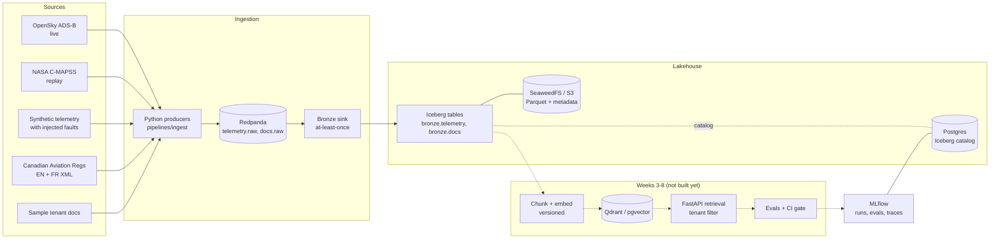

# Architecture

A governed GenAI data platform: raw data -> replayable event log -> Iceberg lake -> (next) chunk/embed -> vector index -> tenant-aware retrieval API -> evals and traces. Everything is provisioned with OpenTofu (`infra/envs/local`, `infra/envs/aws`).

## Diagram

Solid = working today. Dotted = planned. Adminer (`localhost:8081`) is a debugging UI over Postgres and is not part of the data path.

## Components and their ADRs

| Component | Role | Local (OpenTofu) | AWS (OpenTofu) | ADRs |
|---|---|---|---|---|
| Infrastructure as code | One tool for both environments, separate roots and state | `infra/envs/local` (Docker provider) | `infra/envs/aws` | [0001](adr/0001-opentofu-for-iac.md) |
| Message broker | Durable, replayable event log; decouples producers from processing | Redpanda `:9092` | undecided (MSK / Redpanda on ECS), week 9 | [0004](adr/0004-message-broker.md), [0009](adr/0009-reembedding-strategy.md) |
| Object store | Storage for Parquet files and Iceberg metadata | SeaweedFS `:8333` | S3 bucket (versioned, encrypted, private) | [0002](adr/0002-object-store.md) |
| Table format + catalog | Transactions, schema evolution, time travel; catalog rows live in Postgres | pyiceberg SQL catalog | same, RDS-backed | [0003](adr/0003-table-format.md) |
| Postgres + pgvector | Iceberg catalog, MLflow backend, optional vector index | container `:5432` | RDS Postgres 16, private | [0003](adr/0003-table-format.md), [0005](adr/0005-vector-store.md) |
| Vector store | ANN + metadata-filtered search for retrieval | Qdrant `:6333` (idle until week 4) | undecided, week 9 | [0005](adr/0005-vector-store.md), [0007](adr/0007-tenant-isolation.md), [0010](adr/0010-build-vs-buy.md) |
| Chunk/embed layer | Versioned chunks and embeddings with an active-version registry | not built (week 3) | not built | [0006](adr/0006-embedding-versioning.md), [0009](adr/0009-reembedding-strategy.md) |
| Retrieval API | Search and ask endpoints, tenant enforcement, audit log | `services/api` stub | ECR repo + compute in week 9 | [0007](adr/0007-tenant-isolation.md) |
| MLflow | Eval runs, embedding/model versions, later LLM traces and cost | container `:5001` | undecided, week 9 | [0008](adr/0008-experiment-tracking.md) |
| Adminer | Inspect Postgres during development | container `:8081` | none | none |

Full index: [adr/README.md](adr/README.md). Weekly plan: [ROADMAP.md](ROADMAP.md).

## Data model (bronze)

| Table | Grain | Key columns | Notes |
|---|---|---|---|
| `bronze.telemetry` | one sensor event | `aircraft_id` (prefixed `adsb:`, `cmapss:`, or synthetic tail), `event_time`, position, altitude, speed, `engine_temp_c` | partitioned by day of `event_time`; source-specific gaps are nulls (ADS-B has no engine data, C-MAPSS has no position) |
| `bronze.docs` | one document (one CAR section, or one file) | `doc_id`, `tenant`, `content`, `content_sha256`, `lang`, `section_label`, `heading_path` | `lang`, `section_label`, `heading_path` added by schema evolution, so older rows hold nulls |

Every bronze row also carries `_topic`, `_partition`, `_offset`, `_ingested_at`, so a replay can be deduplicated and any row traced to its Kafka message. The sink commits offsets only after the Iceberg commit, so delivery is at-least-once.

## Known simplifications
- Local credentials are dev-only defaults; never reuse them in AWS.
- MLflow installs its packages on each container start. A proper image is a pending task.
- `source` is inferred from the `aircraft_id` prefix; a real column belongs in silver.
- No quality gates or dedupe yet. That is the silver layer.
